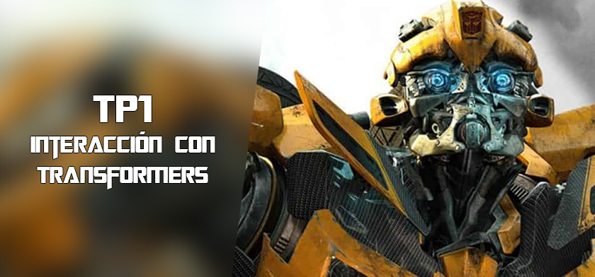

# AYED - TP1 2c2024 - PEREZ MARTINEZ, EMANUEL - 111855

    

## Compilación

El proyecto se puede compilar manualmente por terminal con la siguiente línea:

g++ -I include src/*.cpp main.cpp -o main -Wall -Werror -Wconversion

O, alternativamente, con CMake, utilizando el archivo **CMakeLists.txt** presente en el directorio raíz.

## Aclaraciones adicionales:

Al comienzo, utilicé funciones para manejar las interacciones con el usuario. Posteriormente decidí transformar estas funciones en una clase llamada **Funciones**, que se especializa en mostrar información en pantalla y en el procesamiento de las respuestas del usuario

Tambien tras reflexionar sobre la estructura del menú, concluí que era más apropiado dividir la interacción en dos menús distintos: uno para seleccionar el personaje y otro para determinar las acciones a realizar con ese personaje. Esta separación mejora la fluidez de la conversacion ya que no pregunta al usuario si quiere mandar un nuevo mensaje y evita que el método de sugerencia de fusión se ejecute de forma constante