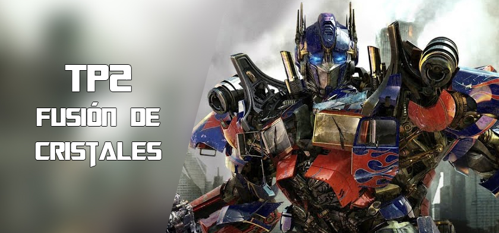

# AYED - TP2 2c2024 - Perez Martinez, Emanuel - 111855

    

## Compilación

El proyecto se puede compilar manualmente por terminal con la siguiente línea:

g++ -I include src/*.cpp main.cpp -o main -Wall -Werror -Wconversion

O, alternativamente, con CMake, utilizando el archivo **CMakeLists.txt** presente en el directorio raíz.

## Aclaraciones adicionales:

While incluido en el main como fue indicado y corregido del tp1 y agregada de igual manera la interfaz de la boveda y los cristales.

Hago uso de constantes en las respuestas de OPrime y Megatron por correcciones en el tp1. Algunas constantes fueron escritas en el 
.cpp ya que interferian con la de los tests al ser re-declaradas con el mismo nombre.

Se usaron enum para el animo e intencion de las clases OPrime y Megatron respectivamente.

Se creo la clase GestorCristales para que el main no se vea tan desorganizado.

El formato de salida del metodo exportar_cristales es el siguiente:

Nombre: cristales.csv

Formato: Rareza;Fuerza;Velocidad;Defensa

Intente manejar las excepciones lo mejor posible y que no se pierda informacion si se accede o interactua incorrectamente con la boveda o los cristales.

Creo unos cristales hardcodeados para que el programa empiece con algo en la boveda y la opcion de fusionar cristales se encuentra en el mismo menu que la boveda porque tienen mucho en comun ya que la boveda es un vector de cristales y lo que estos pueden hacer involucra directamente a la boveda y viceversa.

Clase Minusculas implementada como se aconsejo en el tp1.